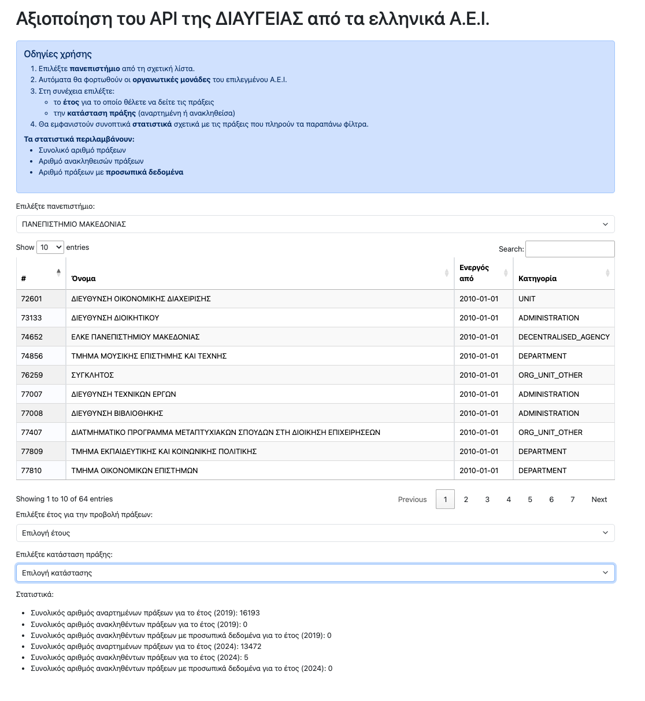

# diavgeia-api-analysis-greek-universities
A full-stack web application that utilizes the DIAVGEIA public data API to collect, analyze, and visualize decisions from three Greek universities (University of Piraeus, University of Macedonia, University of Ioannina) for the period 2019–2024. The application is built with Python (Flask) for the backend and uses Javascript, Bootstrap and DataTables for the frontend.

## Diavgeia API Documentation
The full documentation can be found here: https://diavgeia.gov.gr/api/help

## 🚀 Getting Started

### Prerequisites
- Python 3.7 or newer
- Git (optional but recommended)

### 🛠️ Setup (with virtual environment)
1. Clone the repository
2. Create and activate a virtual environment:
    ```bash
    python3 -m venv venv
    source venv/bin/activate   # For Linux/macOS
    # venv\Scripts\activate    # For Windows
    ```
3. Install dependencies:
    ```bash
    pip install -r requirements.txt
    ```
4. Run the Flask app:
    ```bash
    python3 app.py
    ```
5. Open your browser and go to: http://127.0.0.1:5000/

